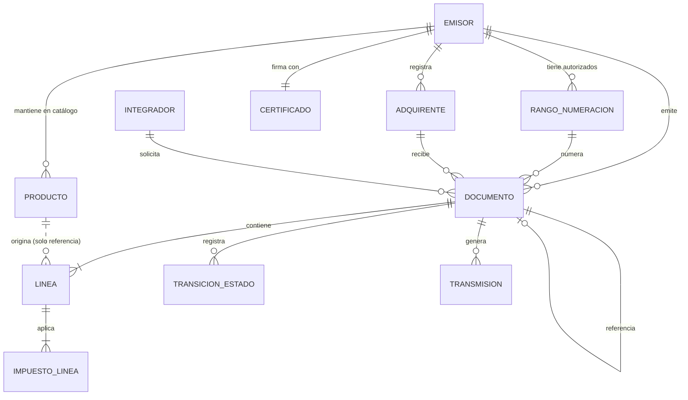

# Modelo de Dominio

**Proyecto:** FEV-Core — API de emisión de documentos electrónicos (Colombia)
**Versión:** 1.0
**Fecha:** 24 de septiembre de 2026
**Autor:** Breiner Stiven Guisao Rodríguez
**Documentos previos:** `01-vision-alcance.md` v1.0, `02-requerimientos.md` v1.0
**Estado:** Aprobado para pasar a diseño de arquitectura

---

## 1. Propósito

Describir las entidades del dominio, sus atributos, sus relaciones y las invariantes que cada una debe mantener. Este documento traduce las reglas de negocio de la etapa 2 a una estructura que el código podrá reflejar.

**Lo que este documento no es:** no es un esquema de base de datos. No define tipos SQL, índices ni claves foráneas. Un modelo de dominio describe el negocio; el esquema de datos es una consecuencia posterior, y puede no coincidir uno a uno.

---

## 2. Lenguaje ubicuo

El modelo usa un solo nombre para cada concepto, y ese nombre es el que se usará en el código, en la API, en la documentación y al hablar del proyecto. Cuando el nombre del negocio y el nombre técnico difieren, gana el del negocio.

| Término del modelo | Qué es | Qué **no** es |
|---|---|---|
| **Emisor** | La empresa que expide el documento. | No es "usuario"; el usuario de la API es el integrador. |
| **Adquirente** | Quien recibe el documento y adquiere el bien o servicio. | No es "cliente" en el modelo, aunque así se le diga en conversación. |
| **Documento** | Cualquier documento electrónico emitido: factura, nota crédito o nota débito. | No es "factura"; la factura es un tipo de documento. |
| **Línea** | Cada renglón de detalle de un documento. | No es "producto"; la línea contiene una copia de datos del producto. |
| **Producto** | Un elemento del catálogo del emisor: bien o servicio. | No es lo que se factura; lo que se factura es una línea. |
| **Rango de numeración** | Conjunto de números consecutivos autorizados, con vigencia. | No es un contador; tiene límites, fechas y estado. |
| **Consecutivo** | El número concreto asignado a un documento dentro de un rango. | No es el identificador del documento. |
| **Transmisión** | Cada intento de entregar un documento al servicio de validación. | No es el documento; un documento puede tener varias transmisiones. |
| **Veredicto** | El resultado que la autoridad devuelve: aprobado o rechazado. | No es el estado del documento; el estado incluye situaciones sin veredicto. |

> El término **factura** se reserva para el documento de tipo factura. Decir "factura" cuando se habla de una nota crédito es el error de vocabulario más común en este dominio y produce código donde las notas heredan comportamientos que no les corresponden.

---

## 3. Vista general

La línea punteada entre `PRODUCTO` y `LINEA` es deliberada: la relación es informativa, no estructural. Una línea no depende del producto para existir ni para conservar su valor. Ver sección 6.1.

---

## 4. Entidades

Cada entidad se describe con sus atributos y sus **invariantes**: condiciones que deben ser ciertas siempre, en cualquier momento de la vida del objeto. Una invariante violada es un error del sistema, no un error del usuario.

---

### 4.1 Emisor

La empresa que expide documentos. En la versión 1 existe uno solo por instalación.

| Atributo | Descripción |
|---|---|
| `identificacion` | Número de identificación tributaria, con su dígito de verificación. |
| `tipoIdentificacion` | Tipo de documento de identificación. |
| `razonSocial` | Nombre legal. |
| `nombreComercial` | Nombre con el que opera, si difiere del legal. |
| `direccion` | Dirección física. |
| `municipio` | Municipio y departamento, con su código oficial. |
| `regimen` | Régimen tributario al que pertenece. |
| `responsabilidades` | Lista de responsabilidades tributarias. |
| `correo` | Correo de contacto. |
| `telefono` | Teléfono de contacto. |
| `certificado` | Referencia al certificado de firma. |

**Invariantes**
- `INV-EMI-01`: el dígito de verificación debe ser consistente con el número de identificación.
- `INV-EMI-02`: un emisor sin certificado válido no puede emitir. *(RF-05)*
- `INV-EMI-03`: debe tener al menos una responsabilidad tributaria declarada.

---

### 4.2 Certificado

El certificado digital con el que se firman los documentos.

| Atributo | Descripción |
|---|---|
| `contenido` | El archivo del certificado, almacenado de forma protegida. |
| `clave` | La clave de acceso al certificado, almacenada de forma protegida. |
| `vigenteDesde` / `vigenteHasta` | Periodo de validez. |
| `numeroSerie` | Número de serie, para identificarlo sin exponerlo. |

**Invariantes**
- `INV-CER-01`: no puede usarse para firmar fuera de su periodo de vigencia.
- `INV-CER-02`: ni el contenido ni la clave pueden aparecer en respuestas de la API ni en registros de actividad. *(RNF-01)*

> El certificado se modela como entidad aparte y no como campos del emisor porque tiene un ciclo de vida propio: vence, se renueva y se reemplaza sin que el emisor cambie.

---

### 4.3 Rango de numeración

Un conjunto de números autorizados para un tipo de documento.

| Atributo | Descripción |
|---|---|
| `prefijo` | Prefijo alfanumérico de la numeración. |
| `tipoDocumento` | Tipo de documento al que aplica. |
| `numeroInicial` / `numeroFinal` | Límites del rango, inclusivos. |
| `vigenteDesde` / `vigenteHasta` | Periodo de vigencia. |
| `ultimoAsignado` | Último número entregado. |
| `numeroAutorizacion` | Identificador de la autorización otorgada. |
| `claveTecnica` | Clave asociada a la autorización, necesaria para el cálculo del código único. |

**Invariantes**
- `INV-RAN-01`: `numeroFinal` > `numeroInicial`. *(RF-08)*
- `INV-RAN-02`: `ultimoAsignado` está entre `numeroInicial - 1` y `numeroFinal`.
- `INV-RAN-03`: dos rangos activos del mismo prefijo y tipo no pueden solaparse. *(RF-08)*
- `INV-RAN-04`: un rango vencido o agotado no entrega números. *(RN-02)*

**Comportamiento**

El rango es el único responsable de entregar consecutivos. Nadie más incrementa `ultimoAsignado`. La operación es: *"dame el siguiente número"*, y el rango responde con el número o con un fallo explícito si está agotado o vencido.

Concentrar esa responsabilidad en una sola entidad es lo que hace posible garantizar RN-01 bajo concurrencia. Si el número se calculara desde fuera —consultando el máximo existente y sumando uno— dos emisiones simultáneas obtendrían el mismo valor. *(RNF-06)*

---

### 4.4 Adquirente

Quien recibe el documento.

| Atributo | Descripción |
|---|---|
| `tipoIdentificacion` / `identificacion` | Identificación tributaria. |
| `razonSocial` | Nombre o razón social. |
| `direccion`, `municipio` | Ubicación. |
| `correo`, `telefono` | Contacto. |
| `regimen`, `responsabilidades` | Situación tributaria. |
| `activo` | Si está disponible para nuevas emisiones. |

**Invariantes**
- `INV-ADQ-01`: no pueden existir dos adquirentes activos con la misma combinación de tipo y número de identificación. *(RF-06)*
- `INV-ADQ-02`: un adquirente nunca se elimina, solo se desactiva. Los documentos ya emitidos deben conservar su referencia.

---

### 4.5 Producto

Un elemento del catálogo del emisor.

| Atributo | Descripción |
|---|---|
| `codigo` | Código interno del emisor. |
| `descripcion` | Descripción del bien o servicio. |
| `unidadMedida` | Unidad en que se vende. |
| `precioUnitario` | Precio de referencia vigente. |
| `impuestosAplicables` | Lista de impuestos con sus tarifas. |
| `activo` | Si está disponible para nuevas emisiones. |

**Invariantes**
- `INV-PRO-01`: `precioUnitario` mayor o igual a cero.
- `INV-PRO-02`: un producto nunca se elimina, solo se desactiva.

> `precioUnitario` es **de referencia**. Es el valor que se propone al emitir, no el que queda en la factura. Ver sección 6.1.

---

### 4.6 Documento

La entidad central. Representa una factura, una nota crédito o una nota débito.

| Atributo | Descripción |
|---|---|
| `id` | Identificador interno, opaco y único. |
| `tipo` | Factura, nota crédito o nota débito. |
| `referenciaExterna` | Identificador que el integrador asigna a la operación. *(RF-15)* |
| `prefijo` + `consecutivo` | Número asignado. |
| `rangoId` | Rango del que se tomó el número. |
| `fechaEmision` | Fecha y hora de emisión. |
| `estado` | Estado actual, según la máquina de la sección 6 del documento de requerimientos. |
| `adquirenteSnapshot` | Copia de los datos del adquirente al momento de emitir. |
| `emisorSnapshot` | Copia de los datos del emisor al momento de emitir. |
| `lineas` | Las líneas de detalle. |
| `moneda` | Moneda del documento. |
| `formaPago`, `medioPago` | Condiciones de pago. |
| `totales` | Valores calculados del documento. |
| `documentoReferenciadoId` | Para notas: la factura que corrigen. |
| `motivoReferencia` | Para notas: la causa de la corrección. |
| `xmlFirmado` | El documento firmado, tal como fue transmitido. |
| `codigoUnico` | Código asignado por la autoridad al aprobar. *(RF-20)* |
| `erroresValidacion` | Errores devueltos si fue rechazado. *(RF-21)* |
| `integradorId` | Quién solicitó la emisión. *(RF-02)* |

**Invariantes**
- `INV-DOC-01`: debe tener al menos una línea. *(RN-08)*
- `INV-DOC-02`: el total debe ser exactamente la suma de las bases más los impuestos menos los descuentos. *(RN-09)*
- `INV-DOC-03`: si el tipo es nota crédito o nota débito, `documentoReferenciadoId` es obligatorio y debe apuntar a una factura en estado `APROBADO`. *(RN-03)*
- `INV-DOC-04`: si el tipo es factura, `documentoReferenciadoId` debe estar vacío. *(RN-05)*
- `INV-DOC-05`: la combinación `prefijo` + `consecutivo` es única. *(RN-01)*
- `INV-DOC-06`: la combinación `integradorId` + `referenciaExterna` es única. *(RF-15)*
- `INV-DOC-07`: una vez en estado `APROBADO`, ningún atributo cambia. *(RN-10)*
- `INV-DOC-08`: el estado solo cambia según las transiciones permitidas. *(RN-11)*

---

### 4.7 Línea

Un renglón de detalle. **Contiene copias, no referencias.**

| Atributo | Descripción |
|---|---|
| `numero` | Posición dentro del documento. |
| `productoId` | Referencia al producto de origen. **Solo informativa.** |
| `codigo` | Copia del código del producto. |
| `descripcion` | Copia de la descripción. |
| `unidadMedida` | Copia de la unidad. |
| `cantidad` | Cantidad facturada. |
| `precioUnitario` | Copia del precio al momento de emitir. |
| `descuento` | Descuento aplicado a la línea. |
| `baseGravable` | `cantidad × precioUnitario − descuento`. |
| `impuestos` | Lista de impuestos aplicados. |
| `total` | `baseGravable` + suma de impuestos. |

**Invariantes**
- `INV-LIN-01`: `cantidad` > 0 y `precioUnitario` > 0. *(RN-08)*
- `INV-LIN-02`: `descuento` menor o igual a `cantidad × precioUnitario`.
- `INV-LIN-03`: ninguno de los valores copiados cambia si el producto de origen cambia. *(RN-10)*
- `INV-LIN-04`: `productoId` puede apuntar a un producto desactivado, o incluso inexistente, sin que la línea pierda validez.

---

### 4.8 Impuesto de línea

Un impuesto aplicado a una línea. Se modela como colección para no atarse a un solo tributo.

| Atributo | Descripción |
|---|---|
| `tipo` | Tipo de impuesto. |
| `tarifa` | Porcentaje aplicado, copiado al emitir. |
| `baseGravable` | Base sobre la que se calcula. |
| `valor` | Resultado del cálculo. |

**Invariantes**
- `INV-IMP-01`: `tarifa` mayor o igual a cero.
- `INV-IMP-02`: `valor` = `baseGravable` × `tarifa`, sin redondear en este nivel. *(RN-06)*
- `INV-IMP-03`: una línea no puede tener dos impuestos del mismo tipo.

> En la versión 1 casi toda línea tendrá un solo impuesto. La colección existe porque agregar un segundo tributo después no debe obligar a migrar datos ni a reescribir el cálculo de totales.

---

### 4.9 Totales del documento

No es una entidad independiente sino un conjunto de valores calculados que viven dentro del documento.

| Atributo | Descripción |
|---|---|
| `totalBrutoAntesImpuestos` | Suma de las bases gravables. |
| `totalDescuentos` | Suma de descuentos. |
| `totalBaseImponible` | Base sobre la que se liquidan impuestos. |
| `totalImpuestos` | Suma de todos los impuestos. |
| `totalAPagar` | Valor final. |

**Invariantes**
- `INV-TOT-01`: se calculan siempre a partir de las líneas. Nunca se reciben desde afuera ni se editan.
- `INV-TOT-02`: el redondeo se aplica en este nivel, sobre el total, no línea por línea. *(RN-06)*

> **Por qué importa el nivel del redondeo.** Si cada línea se redondea por separado, la suma de las líneas redondeadas puede diferir en unos pesos del total calculado sobre los valores exactos. La validación de la autoridad compara ambos y rechaza el documento por inconsistencia. Es un error documentado en implementaciones reales, y la causa de rechazos que parecen inexplicables.

---

### 4.10 Transición de estado

Registro histórico de cada cambio de estado. *(RF-23, RN-12)*

| Atributo | Descripción |
|---|---|
| `estadoAnterior` / `estadoNuevo` | Los estados involucrados. |
| `ocurridaEn` | Marca de tiempo. |
| `motivo` | Qué produjo el cambio. |
| `detalle` | Información adicional. |

**Invariantes**
- `INV-TRA-01`: es inmutable. Una transición nunca se modifica ni se borra.
- `INV-TRA-02`: el `estadoAnterior` de una transición coincide con el `estadoNuevo` de la anterior.

---

### 4.11 Transmisión

Cada intento de entregar el documento al servicio de validación. *(RF-18, RNF-05)*

| Atributo | Descripción |
|---|---|
| `numeroIntento` | Cuál intento es. |
| `enviadaEn` | Cuándo se envió. |
| `identificadorSeguimiento` | Identificador devuelto por el servicio. |
| `resultado` | Qué pasó: aceptada, error transitorio, error definitivo, sin respuesta. |
| `respuestaCruda` | La respuesta completa, para diagnóstico. |

**Invariantes**
- `INV-TRM-01`: es inmutable una vez creada.
- `INV-TRM-02`: un resultado de `SIN_RESPUESTA` significa que se desconoce si el documento llegó. *(RN-13)*

> Modelar la transmisión como entidad separada, y no como campos del documento, es lo que permite cumplir RN-13. Si solo se guardara "último resultado", un reintento borraría la evidencia del intento anterior, y con ella la información de que hubo un envío cuyo destino se desconoce.

---

### 4.12 Integrador

El sistema externo que consume la API. *(RF-01, RF-02)*

| Atributo | Descripción |
|---|---|
| `nombre` | Nombre del sistema integrador. |
| `llaveHash` | Huella criptográfica de la llave. **Nunca la llave.** |
| `activo` | Si puede operar. |
| `creadoEn`, `ultimoAccesoEn` | Datos de control. |

**Invariantes**
- `INV-INT-01`: la llave en texto plano se muestra una única vez, al crearse, y no se almacena. *(RNF-01)*
- `INV-INT-02`: un integrador desactivado no puede autenticarse.
- `INV-INT-03`: un integrador nunca se elimina, para no perder la trazabilidad de los documentos que emitió.

---

## 5. Agregados

Un **agregado** es un grupo de entidades que se trata como una unidad: se carga junto, se guarda junto y mantiene sus invariantes como conjunto. La entidad principal del grupo se llama **raíz**, y nada de afuera toca las entidades internas sin pasar por ella.

Definir agregados importa porque marca los límites de las operaciones. Todo lo que está dentro de un agregado debe quedar consistente al terminar una operación; lo que está fuera puede quedar consistente un instante después.

| Agregado | Raíz | Contiene | Justificación |
|---|---|---|---|
| **Documento** | `Documento` | `Linea`, `ImpuestoLinea`, `Totales`, `TransicionEstado`, `Transmision` | Las invariantes INV-DOC-02 y INV-DOC-08 no se pueden verificar sin ver el documento completo. Una línea no tiene sentido fuera de su documento. |
| **Rango de numeración** | `RangoNumeracion` | — | Entrega consecutivos. Debe poder bloquearse por sí solo, sin arrastrar documentos, para no volver lenta la emisión concurrente. |
| **Emisor** | `Emisor` | `Certificado` | El certificado no existe sin emisor y no se consulta por separado. |
| **Adquirente** | `Adquirente` | — | Independiente. Cambia por su cuenta sin afectar documentos ya emitidos. |
| **Producto** | `Producto` | — | Independiente, por la misma razón. |
| **Integrador** | `Integrador` | — | Independiente. |

**Regla que se deriva:** un documento no contiene al adquirente ni al producto, contiene copias de sus datos. Por eso las referencias entre agregados se hacen por identificador y nunca por objeto. Es la misma conclusión de la sección 6.1, alcanzada desde otro lado.

---

## 6. Decisiones de modelado

### 6.1 Las líneas copian, no referencian

**Decisión:** cada línea guarda su propia copia de la descripción, el precio unitario, la unidad de medida y las tarifas de impuesto. El `productoId` se conserva solo como información de origen.

**Alternativa descartada:** que la línea apunte al producto y lea de allí sus valores.

**Razón:** un documento aprobado es una declaración ante la autoridad tributaria sobre una operación que ocurrió en una fecha. Su contenido fue firmado digitalmente y su código único se calculó sobre esos valores. Si el precio del producto cambia después, un documento que leyera del catálogo mostraría valores distintos a los que declaró y firmó. La firma dejaría de corresponder al contenido visible.

**Consecuencia:** hay duplicación de datos, y es intencional. La normalización busca evitar que un mismo hecho se represente en dos lugares y se desincronice, pero aquí no hay un mismo hecho: el precio del catálogo es *el precio actual*, y el precio de la línea es *el precio que se cobró aquel día*. Son dos hechos distintos que coinciden en valor al momento de emitir y luego siguen caminos separados.

Lo mismo aplica a `adquirenteSnapshot` y `emisorSnapshot`. Si el adquirente se muda, sus facturas anteriores conservan la dirección que se declaró.

### 6.2 Identificador interno separado del número del documento

**Decisión:** el documento tiene un `id` interno opaco, distinto del par `prefijo` + `consecutivo`.

**Razón:** el número del documento se asigna desde un rango autorizado y está sujeto a reglas del negocio. El identificador interno existe desde antes de que el documento se numere y sirve para referenciarlo sin depender de esas reglas. Además, un identificador opaco no revela cuántos documentos se han emitido, cosa que un consecutivo expuesto sí hace.

### 6.3 La numeración vive en el rango, no en el documento

**Decisión:** solo `RangoNumeracion` entrega consecutivos.

**Razón:** concentrar la operación en una entidad permite que la garantía de unicidad sea responsabilidad de un solo punto del sistema. La alternativa —calcular el siguiente número consultando los documentos existentes— produce números repetidos en cuanto dos emisiones ocurren al tiempo. *(RNF-06)*

### 6.4 El historial es parte del modelo, no una bitácora técnica

**Decisión:** `TransicionEstado` y `Transmision` son entidades del dominio, no registros de depuración.

**Razón:** RN-13 exige distinguir "la autoridad rechazó el documento" de "no sabemos qué pasó". Esa distinción solo se puede sostener si el historial de intentos es un dato del negocio que se consulta y sobre el que se decide, no texto en un archivo de registro que nadie lee.

### 6.5 Nadie se elimina

**Decisión:** adquirentes, productos e integradores se desactivan, nunca se borran.

**Razón:** un documento emitido conserva referencias a ellos. Borrar un adquirente rompería la trazabilidad de documentos que ya circularon y que tienen efectos fiscales.

---

## 7. Lo que no es una entidad

Enumerarlo evita que el modelo crezca con cosas que parecen entidades y no lo son.

| Concepto | Qué es en realidad |
|---|---|
| **Estado del documento** | Un atributo del documento, gobernado por una máquina de estados. No es una tabla de catálogo. |
| **Tipo de documento** | Un valor cerrado y conocido. No es configurable ni administrable. |
| **Municipio, unidad de medida, tipo de impuesto** | Valores de listas oficiales externas. Se representan por su código y se validan contra la lista; no son entidades del negocio. |
| **Factura, nota crédito, nota débito** | No son tres entidades. Son un `Documento` con distinto `tipo` y distintas invariantes activas. |
| **Totales** | Valores calculados que viven dentro del documento. No existen por separado ni se consultan solos. |
| **Usuario** | No existe en este dominio. Quien consume la API es un `Integrador`, que es un sistema, no una persona. |

---

## 8. Trazabilidad de reglas de negocio

Dónde queda garantizada cada regla de la etapa 2.

| Regla | Dónde se garantiza |
|---|---|
| RN-01 — Número único | `RangoNumeracion` (comportamiento) + `INV-DOC-05` |
| RN-02 — Rango vigente | `INV-RAN-04` |
| RN-03 — Nota referencia factura aprobada | `INV-DOC-03` |
| RN-04 — Notas no superan la factura | Verificación al emitir, sobre el agregado `Documento` referenciado |
| RN-05 — Nota no referencia nota | `INV-DOC-03` + `INV-DOC-04` |
| RN-06 — Redondeo sobre el total | `INV-IMP-02` + `INV-TOT-02` |
| RN-07 — Rechazado no se corrige | Máquina de estados: `RECHAZADO` es terminal |
| RN-08 — Líneas válidas | `INV-DOC-01` + `INV-LIN-01` |
| RN-09 — Total coherente | `INV-DOC-02` |
| RN-10 — Aprobado inmutable | `INV-DOC-07` + `INV-LIN-03` |
| RN-11 — Terminal es terminal | `INV-DOC-08` |
| RN-12 — Toda transición registrada | `TransicionEstado` + `INV-TRA-01` |
| RN-13 — Fallido es incertidumbre | `Transmision` + `INV-TRM-02` |

Las trece reglas tienen un lugar concreto en el modelo donde se hacen cumplir. Ninguna queda a cargo de "que el programador se acuerde".

---

## 9. Control de cambios

| Versión | Fecha | Cambio |
|---|---|---|
| 1.0 | 2026-09-24 | Versión inicial. 12 entidades, 6 agregados, 33 invariantes. |
