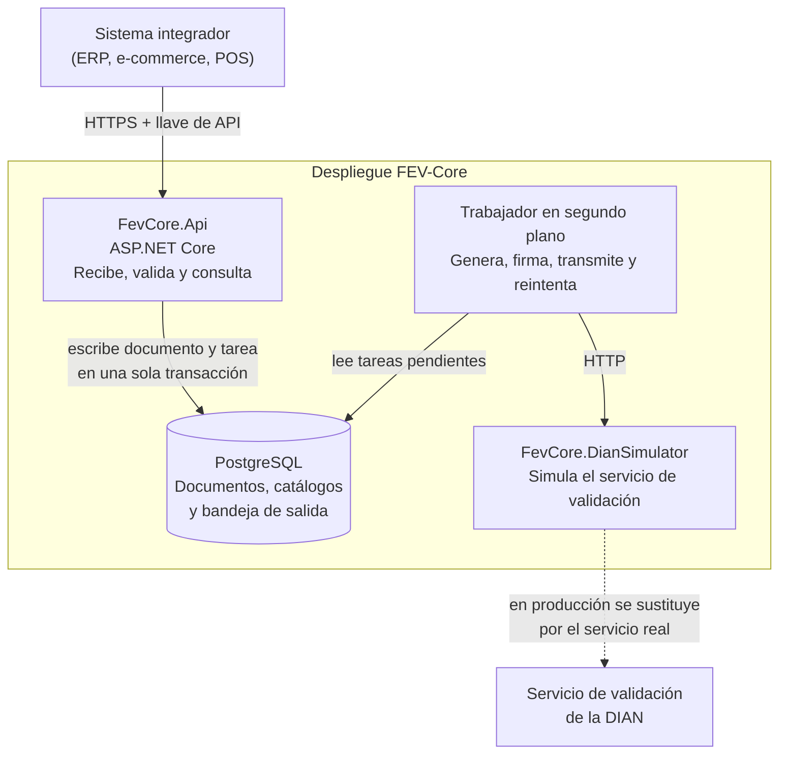
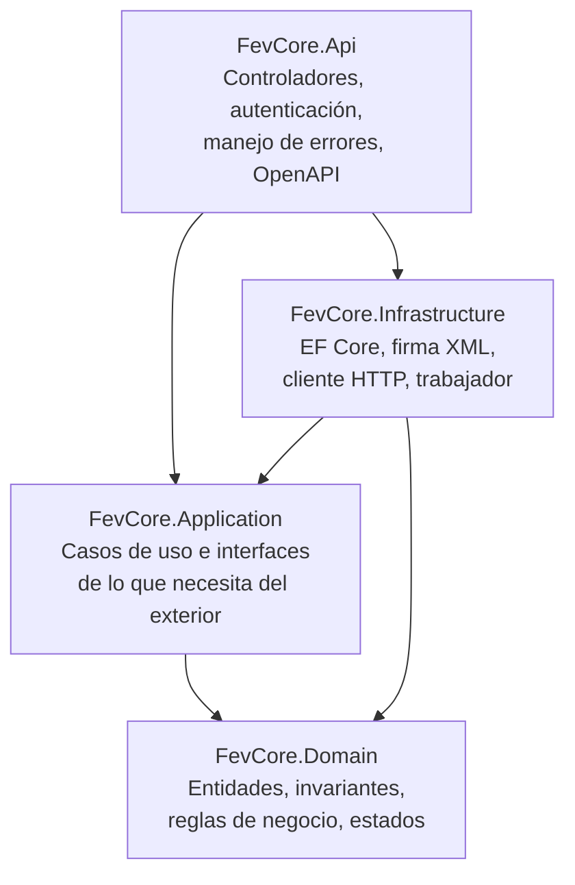
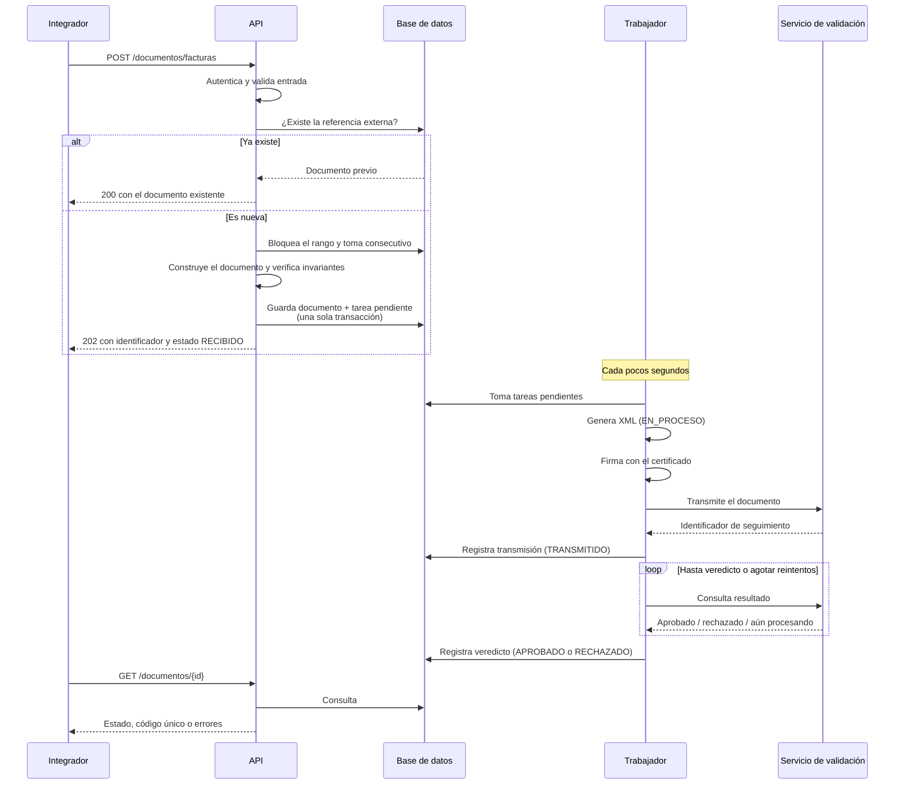

# Documento de Arquitectura

**Proyecto:** FEV-Core — API de emisión de documentos electrónicos (Colombia)
**Versión:** 1.0
**Fecha:** 24 de septiembre de 2026
**Autor:** Breiner Stiven Guisao Rodríguez
**Documentos previos:** `01-vision-alcance.md`, `02-requerimientos.md`, `03-modelo-dominio.md`
**Estado:** Aprobado para pasar a definición del contrato de la API

---

## 1. Propósito

Describir cómo se organiza el sistema para cumplir los requerimientos de la etapa 2 y alojar el modelo de la etapa 3. Este es el primer documento del proyecto que menciona tecnologías concretas, y el orden no es casual: las tres etapas anteriores describen un problema que existiría igual en cualquier lenguaje.

Las decisiones con alternativas reales no se justifican aquí sino en registros independientes (`docs/adr/`). Este documento describe **cómo quedó** el sistema; los registros explican **por qué**.

---

## 2. Vista de contenedores

Qué piezas se despliegan y cómo se hablan entre sí.



`FevCore.Api` y el trabajador viven en el mismo proceso, pero se dibujan aparte porque tienen responsabilidades y ritmos distintos: la API responde a peticiones, el trabajador actúa por su cuenta. Separarlos en procesos distintos más adelante no exige cambios de diseño.

---

## 3. Organización interna

### 3.1 Las capas y la regla de dependencia



**La regla:** las flechas apuntan hacia adentro. `Domain` no depende de nadie. Ni de Entity Framework, ni de ASP.NET, ni de bibliotecas de terceros. Es C# y nada más.

Esa restricción tiene una consecuencia práctica inmediata: las trece reglas de negocio de la etapa 2 se prueban sin levantar base de datos, sin servidor y sin configuración. Una prueba de RN-04 construye un documento en memoria, intenta violar la regla y verifica que no puede. Corre en milisegundos. Eso es lo que hace viable RNF-09.

### 3.2 Cómo se invierte la dependencia

`Application` necesita guardar documentos, pero no puede depender de la base de datos sin romper la regla. La salida es que `Application` **declara lo que necesita** y `Infrastructure` **lo provee**:

| Declarado en `Application` | Implementado en `Infrastructure` |
|---|---|
| `IRepositorioDocumentos` | Implementación con EF Core sobre PostgreSQL |
| `IProveedorValidacion` | Cliente HTTP hacia el simulador o el servicio real |
| `IFirmadorXml` | Firma con el certificado del emisor |
| `IGeneradorXml` | Construcción del XML en formato UBL 2.1 |
| `IRelojSistema` | Fecha y hora actuales |
| `IBandejaSalida` | Lectura y escritura de tareas pendientes |

`IProveedorValidacion` es la abstracción que exige RNF-02. Cambiar del simulador al servicio real de la DIAN es registrar otra implementación en la configuración: ninguna línea de `Application` ni de `Domain` se entera.

`IRelojSistema` parece exagerado hasta que hay que probar que un rango vencido no entrega números. Con la fecha del sistema tomada directamente no se puede probar sin cambiarle la hora a la máquina.

### 3.3 Estructura de la solución

```
FEV-Core/
├── FevCore.sln
├── docker-compose.yml
├── docs/
│   ├── 01-vision-alcance.md
│   ├── 02-requerimientos.md
│   ├── 03-modelo-dominio.md
│   ├── 04-arquitectura.md
│   └── adr/
├── src/
│   ├── FevCore.Domain/
│   │   ├── Documentos/          Documento, Linea, ImpuestoLinea, estados
│   │   ├── Numeracion/          RangoNumeracion
│   │   ├── Emisores/            Emisor, Certificado
│   │   ├── Adquirentes/
│   │   ├── Productos/
│   │   └── Comun/               Tipos base, Dinero, excepciones de dominio
│   ├── FevCore.Application/
│   │   ├── Documentos/          Casos de uso de emisión y consulta
│   │   ├── Catalogos/           Casos de uso de adquirentes y productos
│   │   ├── Numeracion/
│   │   └── Abstracciones/       Las interfaces de la sección 3.2
│   ├── FevCore.Infrastructure/
│   │   ├── Persistencia/        DbContext, configuraciones, migraciones
│   │   ├── Dian/                Cliente del proveedor de validación
│   │   ├── Firma/               Firma digital del XML
│   │   ├── Xml/                 Generación UBL 2.1
│   │   └── Procesamiento/       El trabajador en segundo plano
│   ├── FevCore.Api/
│   │   ├── Controllers/
│   │   ├── Contratos/           Objetos de entrada y salida de la API
│   │   ├── Autenticacion/
│   │   └── Errores/             Traducción de excepciones a respuestas
│   └── FevCore.DianSimulator/   Servicio independiente
└── tests/
    ├── FevCore.Domain.Tests/
    ├── FevCore.Application.Tests/
    └── FevCore.Integration.Tests/
```

### 3.4 Convención de nombres

**Los conceptos del dominio se nombran en español; el andamiaje técnico en inglés.**

```csharp
public sealed class Documento
{
    public RangoNumeracion Rango { get; }
    public IReadOnlyList<Linea> Lineas => _lineas;
}

public interface IRepositorioDocumentos { }

public sealed class EmitirFacturaHandler { }
```

**Razón:** `Emisor`, `Adquirente` y `RangoNumeracion` son términos legales del sistema tributario colombiano. Traducirlos a `Issuer` o `Acquirer` introduce un paso de traducción entre el documento de requerimientos y el código, y ahí es donde se pierden los matices. El lenguaje ubicuo de la sección 2 del modelo de dominio pierde su valor si el código habla otro idioma.

En cambio `Repository`, `Handler` y `Service` no son conceptos del negocio sino patrones de construcción, y tienen nombres establecidos en inglés que cualquier desarrollador reconoce.

---

## 4. Flujo de una emisión

El recorrido completo, desde la petición hasta el veredicto.



Dos momentos merecen atención.

**La verificación de la referencia externa va primero.** Antes de tomar un consecutivo. Si el integrador reintenta una petición que ya había llegado, no se consume un número nuevo. Es RF-15, y es lo que hace seguro que un integrador reintente cuando se le corta la red.

**El consecutivo se toma antes de guardar, dentro de la misma transacción.** No después ni en el trabajador. El número forma parte del documento desde que nace.

---

## 5. La bandeja de salida

El mecanismo que garantiza que ningún documento se quede sin procesar.

### 5.1 El problema

La emisión asíncrona necesita que algo procese el documento después de responderle al integrador. Hacerlo en dos pasos —guardar el documento, luego encolar la tarea— deja una ventana: si el proceso se detiene entre ambos, el documento queda guardado y nadie lo procesa. No falla nada visible; simplemente se queda quieto para siempre.

Este es el problema de **escritura doble**, y aparece siempre que hay que dejar consistentes dos sistemas sin una transacción que cubra a los dos.

### 5.2 La solución

La tarea pendiente es una fila en la misma base de datos, escrita en la **misma transacción** que el documento. O se guardan las dos cosas o no se guarda ninguna.

```
BEGIN
  INSERT documento
  INSERT tarea_pendiente
COMMIT
```

Un trabajador en segundo plano consulta esa tabla cada pocos segundos y procesa lo que encuentre.

### 5.3 Estructura de la tarea

| Campo | Para qué |
|---|---|
| `documentoId` | Qué documento procesar. |
| `tipoTarea` | Qué hacer: transmitir o consultar resultado. |
| `estado` | Pendiente, en proceso, completada o fallida. |
| `intentos` | Cuántas veces se ha intentado. |
| `proximoIntentoEn` | Cuándo volver a intentar. Implementa la espera creciente de RNF-05. |
| `ultimoError` | Qué falló la última vez. |
| `tomadaPor`, `tomadaEn` | Qué trabajador la tiene y desde cuándo. |

### 5.4 Reglas del trabajador

1. **Toma exclusiva.** Al tomar una tarea la marca como suya en la misma operación en que la lee, para que dos trabajadores no procesen la misma.
2. **Espera creciente.** Tras un fallo, `proximoIntentoEn` se aleja progresivamente: unos segundos, luego el doble, luego el doble otra vez. No se reintenta en ciclo cerrado contra un servicio caído.
3. **Límite de intentos.** Agotados los intentos, el documento pasa a `FALLIDO` y la tarea deja de reintentarse. Queda para revisión manual, como exige RN-13.
4. **Recuperación de tareas colgadas.** Una tarea tomada hace demasiado tiempo se considera abandonada —el trabajador murió a mitad— y vuelve a quedar disponible.
5. **Idempotencia.** Procesar una tarea dos veces no puede producir dos transmisiones. Antes de transmitir, el trabajador verifica el estado real del documento.

La regla 4 es la que rescata el caso del servidor que se cae mientras procesaba. Sin ella, esas tareas quedan marcadas como "en proceso" por un trabajador que ya no existe, y nadie las vuelve a tocar.

---

## 6. Numeración bajo concurrencia

RNF-06 exige que dos emisiones simultáneas nunca obtengan el mismo consecutivo.

**Lo que no funciona:** consultar el mayor número emitido y sumarle uno. Dos peticiones que consultan al mismo tiempo leen el mismo valor y ambas generan el mismo número. La base de datos rechazará la segunda por unicidad, pero el integrador recibe un error por algo que era responsabilidad del sistema resolver.

**Lo que se implementa:** al tomar un consecutivo, la fila del rango se bloquea hasta que termine la transacción. La segunda petición espera a que la primera termine, lee el valor ya actualizado y continúa. El bloqueo dura lo que toma incrementar un número.

Aquí se ve el valor de haber definido `RangoNumeracion` como agregado propio en la etapa 3: el bloqueo cae sobre una sola fila, no sobre el documento ni sobre nada más.

**Por qué no se usa una secuencia de la base de datos:** una secuencia no respeta límites ni vigencia, no sabe que el rango tiene un número final ni una fecha de vencimiento, y no se revierte si la transacción falla, lo que dejaría huecos en la numeración. La consecutividad es una exigencia legal, no una comodidad técnica.

---

## 7. Estrategia de pruebas

Las capas determinan qué tipo de prueba corresponde a cada cosa.

| Tipo | Qué prueba | Contra qué corre | Cuántas |
|---|---|---|---|
| **De dominio** | Invariantes y reglas de negocio. Cálculo de totales, transiciones de estado, validez de documentos. | Nada. Objetos en memoria. | Muchas. Son las más valiosas y las más rápidas. |
| **De aplicación** | Casos de uso completos, con las dependencias externas sustituidas por dobles. | Dobles de prueba. | Bastantes. |
| **De integración** | Persistencia real, concurrencia de numeración, ciclo completo contra el simulador. | PostgreSQL y el simulador en contenedores. | Pocas y bien escogidas. |

**Pruebas obligatorias por requerimiento crítico:**

| Prueba | Verifica |
|---|---|
| Emisión concurrente de N documentos | Ningún consecutivo repetido ni saltado. *(CE-03, RNF-06)* |
| Servicio de validación apagado | La emisión sigue aceptándose; los documentos quedan en espera, no en error. *(RNF-04)* |
| Servicio que responde con demora superior al tiempo de espera | El documento no queda en estado indeterminado. *(CE-04)* |
| Proceso interrumpido a mitad de una tarea | La tarea se recupera y el documento se procesa. *(Sección 5.4, regla 4)* |
| Misma referencia externa dos veces | Un solo documento, un solo consecutivo. *(RF-15)* |
| XML generado | Válido contra el esquema oficial. *(CE-05)* |
| XML firmado y luego alterado | La firma deja de verificar. *(RF-17)* |

---

## 8. Configuración y secretos

Todo lo que cambia entre entornos va por variables de entorno. Nada de eso entra al repositorio. *(RNF-01)*

| Variable | Para qué |
|---|---|
| Cadena de conexión a la base de datos | Acceso a PostgreSQL. |
| Dirección del proveedor de validación | A qué servicio transmitir. Es lo único que cambia entre simulador y servicio real. |
| Ruta y clave del certificado | Firma digital. |
| Intervalo de consulta del trabajador | Cada cuánto revisa la bandeja. |
| Máximo de reintentos y espera base | Política de RNF-05. |

El repositorio incluye un archivo de ejemplo con los nombres de las variables y valores de muestra, sin secretos reales.

---

## 9. Despliegue local

`docker-compose.yml` levanta tres servicios: la API, el simulador y PostgreSQL. Las migraciones se aplican al arrancar.

```
docker compose up
```

Un solo comando en una máquina limpia, como exige RNF-08 y el criterio CE-06.

---

## 10. Registros de decisión

| # | Decisión |
|---|---|
| [ADR-0001](adr/0001-plataforma-dotnet.md) | Plataforma .NET y ASP.NET Core |
| [ADR-0002](adr/0002-arquitectura-por-capas.md) | Arquitectura por capas con dominio independiente |
| [ADR-0003](adr/0003-postgresql.md) | PostgreSQL como motor de base de datos |
| [ADR-0004](adr/0004-entity-framework-core.md) | Entity Framework Core como mapeador |
| [ADR-0005](adr/0005-emision-asincrona.md) | Emisión asíncrona |
| [ADR-0006](adr/0006-bandeja-de-salida.md) | Bandeja de salida para el trabajo pendiente |
| [ADR-0007](adr/0007-abstraccion-proveedor-validacion.md) | Abstracción del proveedor de validación y simulador independiente |
| [ADR-0008](adr/0008-autenticacion-llave-api.md) | Autenticación por llave de API |
| [ADR-0009](adr/0009-bloqueo-numeracion.md) | Bloqueo pesimista en la asignación de consecutivos |

---

## 11. Trazabilidad

Cómo cada requerimiento no funcional se satisface.

| RNF | Dónde se resuelve |
|---|---|
| RNF-01 — Sin secretos en el repositorio | Sección 8 |
| RNF-02 — Proveedor de validación sustituible | Sección 3.2, ADR-0007 |
| RNF-03 — Respuesta rápida en emisión | Sección 4: la API no contacta servicios externos |
| RNF-04 — Continúa con el servicio caído | Sección 5, ADR-0006 |
| RNF-05 — Reintentos con espera creciente | Sección 5.4, reglas 2 y 3 |
| RNF-06 — Numeración correcta bajo concurrencia | Sección 6, ADR-0009 |
| RNF-07 — OpenAPI desde el código | Capa API |
| RNF-08 — Un solo comando | Sección 9 |
| RNF-09 — Reglas de negocio con pruebas | Sección 3.1 y sección 7 |
| RNF-10 — Registros con correlación | Capa API e infraestructura |
| RNF-11 — Errores útiles sin filtrar detalles internos | `FevCore.Api/Errores` |
| RNF-12 — Precisión decimal en dinero | Tipo `Dinero` en `Domain/Comun` |

---

## 12. Control de cambios

| Versión | Fecha | Cambio |
|---|---|---|
| 1.0 | 2026-09-24 | Versión inicial. 4 capas, 5 proyectos de código, 9 registros de decisión. |
