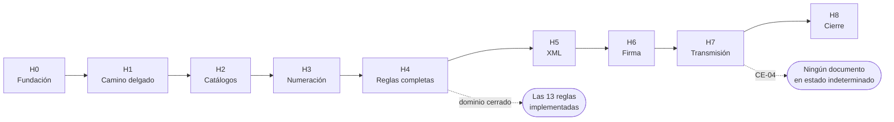

# Plan de Entregas

**Proyecto:** FEV-Core — API de emisión de documentos electrónicos (Colombia)
**Versión:** 1.0
**Fecha:** 24 de septiembre de 2026
**Autor:** Breiner Stiven Guisao Rodríguez
**Documentos previos:** etapas 1 a 5
**Estado:** Aprobado. Última etapa previa a la implementación.

---

## 1. Propósito

Partir el trabajo en hitos ordenados por dependencia, donde cada uno termina con algo que se ejecuta y se puede demostrar.

**Sin estimaciones de tiempo.** El plan ordena por dependencias, no por fechas. Una estimación inventada sobre una plataforma que el autor está aprendiendo sería un número falso, y un plan con fechas falsas es peor que uno sin fechas: invita a medir el avance contra una ficción.

---

## 2. Principio rector: cortes verticales

Cada hito atraviesa todas las capas y entrega un camino delgado pero completo, en lugar de completar una capa entera antes de pasar a la siguiente.

| Corte horizontal (descartado) | Corte vertical (adoptado) |
|---|---|
| Hito 1: todas las entidades | Hito 1: emitir una factura mínima, de punta a punta |
| Hito 2: toda la persistencia | Hito 2: la misma factura, con catálogos reales |
| Hito 3: todos los endpoints | Hito 3: la misma factura, con numeración correcta |
| Nada funciona hasta el final | Algo funciona desde el primer hito |

**Dos razones.**

La primera es que los errores de diseño aparecen cuando las piezas se tocan. Si el modelo tiene un defecto que solo se nota al exponerlo por HTTP, con cortes verticales se descubre en el hito 1; con cortes horizontales, dos hitos de código después.

La segunda es de resultado: si el proyecto se detiene en cualquier punto, lo construido funciona. Un sistema que corre y hace poco vale más que uno completo en el papel que no arranca.

---

## 3. Definición de terminado

Un hito está terminado cuando **todo** lo siguiente es cierto. No hay terminado parcial.

1. Los requerimientos asignados al hito están implementados.
2. Cada regla de negocio del hito tiene una prueba que la verifica y otra que verifica su violación. *(RNF-09)*
3. Todas las pruebas pasan en integración continua.
4. `docker compose up` levanta el sistema desde cero en una máquina limpia. *(RNF-08)*
5. La demostración del hito se puede ejecutar y produce el resultado esperado.
6. La documentación afectada está actualizada.
7. La rama del hito está integrada a `main` mediante pull request.

El punto 4 se verifica **en cada hito**, no solo al final. Es la forma de que RNF-08 no se convierta en una tarea de última hora que nadie logra cumplir.

---

## 4. Los hitos

### H0 — Fundación

**Objetivo:** que exista un esqueleto ejecutable y que el autor haya escrito su primer código en C#. Este hito no implementa ningún requerimiento del negocio, y eso es deliberado: mitiga el riesgo R-03 aprendiendo la plataforma sin la presión de reglas de dominio encima.

**Entra**
- Solución con los cinco proyectos de código y los tres de pruebas, según la sección 3.3 del documento de arquitectura.
- `GET /health` que responde que el servicio vive.
- `docker-compose.yml` con la API y PostgreSQL.
- Una prueba unitaria trivial que pase.
- Integración continua que compile y ejecute las pruebas en cada push.
- `.gitignore`, `.gitattributes`, `.env.example`, README inicial.
- **Prueba de concepto de firma digital:** un programa desechable de unas pocas líneas que firme un XML de juguete y verifique la firma. No forma parte de la solución y se borra después.

**No entra**
- Ninguna entidad de dominio, ningún endpoint del negocio, ninguna tabla.

**Demostración**
```
docker compose up
curl http://localhost:8080/health      →  200
dotnet test                            →  todas pasan
```

**Por qué la prueba de concepto de firma va aquí.** El riesgo R-05 identifica la firma digital como la parte técnicamente más difícil, capaz de bloquear el avance. Descubrir en el hito 6 que no se logra firmar sería descubrirlo con seis hitos construidos encima. Veinte líneas desechables en el hito 0 retiran ese riesgo antes de que cueste algo.

---

### H1 — El camino delgado

**Objetivo:** emitir una factura y consultarla, de punta a punta. Mínima en todo lo demás.

**Entra**
- Entidades `Documento`, `Linea` e `ImpuestoLinea` con el cálculo de totales. *(RN-06, RN-09, INV-TOT-01, INV-TOT-02)*
- Tipo `Dinero` con precisión decimal. *(RNF-12)*
- Persistencia con EF Core y primera migración.
- `POST /facturas` y `GET /documentos/{id}`. *(RF-11 parcial, RF-14, RF-22)*
- Autenticación por llave de API. *(RF-01, RF-02, RNF-01)*
- Manejo de errores en formato Problem Details. *(RNF-11)*
- Registros estructurados con identificador de correlación. *(RNF-10)*

**No entra**
- Numeración por rangos: el consecutivo es un contador simple y provisional.
- Catálogos: adquirente y productos se envían en crudo dentro de la petición.
- XML, firma, transmisión, notas, estados más allá de `RECIBIDO`.

**Demostración**
```
POST /api/v1/facturas con dos líneas   →  202, con totales calculados
GET  /api/v1/documentos/{id}           →  200, el documento
POST sin llave de API                  →  401
```

**Requerimientos:** RF-01, RF-02, RF-14, RF-22, RNF-01, RNF-10, RNF-11, RNF-12. Reglas RN-06, RN-08, RN-09.

---

### H2 — Catálogos y copia de datos

**Objetivo:** que la factura referencie entidades reales y copie sus datos al emitirse.

**Entra**
- Entidades `Emisor`, `Certificado`, `Adquirente`, `Producto`.
- Endpoints `/emisor`, `/adquirentes`, `/productos`. *(RF-03, RF-04, RF-06, RF-07)*
- Validación de emisor completo antes de emitir. *(RF-05)*
- Copia de datos al emitir: `emisorSnapshot`, `adquirenteSnapshot` y los valores de cada línea. *(INV-LIN-03, RN-10)*
- Desactivación en lugar de borrado. *(INV-ADQ-02, INV-PRO-02)*

**No entra**
- Numeración por rangos, XML, firma, transmisión, notas.

**Demostración**
```
Registrar emisor, adquirente y dos productos
Emitir factura referenciando esos productos
Cambiar el precio de un producto
GET del documento anterior            →  conserva el precio original
```

Esa última verificación es la prueba de RN-10, la regla que motivó toda la decisión de copiar en lugar de referenciar.

**Requerimientos:** RF-03, RF-04, RF-05, RF-06, RF-07. Reglas RN-10.

---

### H3 — Numeración

**Objetivo:** que los consecutivos sean correctos, incluso bajo emisión simultánea.

**Entra**
- Entidad `RangoNumeracion` con su comportamiento de entrega de consecutivos.
- Endpoints `/rangos-numeracion`. *(RF-08, RF-10)*
- Asignación con bloqueo pesimista de fila. *(ADR-0009)*
- Restricción de unicidad en base de datos como red de seguridad.
- Prueba de concurrencia: N emisiones simultáneas, ningún número repetido ni saltado. *(RNF-06)*

**No entra**
- XML, firma, transmisión, notas.

**Demostración**
```
Registrar un rango de 10 números
Emitir 10 facturas en paralelo        →  consecutivos 1 al 10, sin repetir
Emitir la número 11                   →  409 RANGO_AGOTADO
Registrar un rango vencido y emitir   →  409 RANGO_VENCIDO
```

**Requerimientos:** RF-08, RF-09, RF-10, RNF-06. Reglas RN-01, RN-02.

---

### H4 — Reglas de negocio completas

**Objetivo:** cerrar el dominio. Notas, máquina de estados y reintentos seguros.

**Entra**
- `POST /notas-credito` y `POST /notas-debito`. *(RF-12, RF-13)*
- Validación de documento referenciado. *(RN-03, RN-05)*
- Límite acumulado de notas crédito. *(RN-04)*
- Máquina de estados con transiciones validadas y estados terminales. *(RN-11)*
- Historial de transiciones y endpoint de consulta. *(RF-23, RN-12)*
- Idempotencia por referencia externa, con la distinción entre `202` y `200`. *(RF-15)*

**No entra**
- XML, firma, transmisión. Los documentos siguen quedando en `RECIBIDO`.

**Demostración**
```
Emitir factura, forzar su estado a APROBADO
Emitir nota crédito por la mitad del valor      →  202
Emitir otra nota crédito por el total           →  409 NOTA_EXCEDE_VALOR_FACTURA
Emitir nota que referencia otra nota            →  409 DOCUMENTO_REFERENCIADO_INVALIDO
Reenviar una emisión con la misma referencia    →  200, mismo documento, mismo consecutivo
GET /documentos/{id}/historial                  →  la secuencia de transiciones
```

**Requerimientos:** RF-12, RF-13, RF-15, RF-23. Reglas RN-03, RN-04, RN-05, RN-11, RN-12.

Terminado este hito, **las trece reglas de negocio están implementadas y probadas**. Lo que sigue es técnico.

---

### H5 — Generación del XML

**Objetivo:** producir el documento en el formato exigido.

**Entra**
- `IGeneradorXml` y su implementación en formato UBL 2.1 con adendas colombianas. *(RF-16)*
- Validación automatizada contra el esquema oficial. *(CE-05)*
- Documentación de qué campos del estándar se implementaron y cuáles se omitieron, con su razón. *(Mitigación de R-01)*
- Transición `RECIBIDO → EN_PROCESO` al generar.

**No entra**
- Firma, transmisión.

**Demostración**
```
Emitir una factura
Obtener su XML                        →  valida contra el esquema oficial
```

**Requerimientos:** RF-16.

**Riesgo:** es el hito con más probabilidad de desbordarse. El estándar es extenso y la tentación es implementarlo completo. La disciplina es el subconjunto mínimo que produce un documento válido, con lo omitido documentado.

---

### H6 — Firma digital

**Objetivo:** firmar el XML de forma verificable.

**Entra**
- `IFirmadorXml` y su implementación. *(RF-17)*
- Carga del certificado desde configuración, sin exponerlo. *(INV-CER-02)*
- Validación de vigencia del certificado. *(INV-CER-01)*
- `GET /documentos/{id}/xml`. *(RF-25)*

**No entra**
- Transmisión.

**Demostración**
```
Emitir una factura y descargar su XML     →  contiene la firma
Verificar la firma con la clave pública   →  válida
Alterar un byte del XML y verificar       →  inválida
Configurar un certificado vencido         →  409 CERTIFICADO_VENCIDO
```

**Requerimientos:** RF-17, RF-25.

La prueba de concepto del hito 0 debería haber retirado la mayor parte del riesgo de este hito.

---

### H7 — Transmisión asíncrona

**Objetivo:** el ciclo completo. Es el hito que da sentido a toda la arquitectura.

**Entra**
- `FevCore.DianSimulator` como servicio independiente, con demoras y fallos configurables. *(ADR-0007)*
- `IProveedorValidacion` y su implementación por HTTP. *(RNF-02)*
- Bandeja de salida: tarea persistida en la misma transacción que el documento. *(ADR-0006)*
- Trabajador en segundo plano con toma exclusiva, espera creciente, límite de intentos y recuperación de tareas abandonadas. *(RNF-04, RNF-05)*
- Estados `TRANSMITIDO`, `APROBADO`, `RECHAZADO`, `FALLIDO`.
- Registro de código único y de errores de validación. *(RF-18, RF-19, RF-20, RF-21)*
- Entidad `Transmision` con resultado `SIN_RESPUESTA`. *(RN-13)*

**No entra**
- Notificación saliente al integrador. Fuera de alcance de la versión 1.

**Demostración**
```
Emitir una factura                                  →  llega a APROBADO sola
Configurar el simulador para rechazar               →  llega a RECHAZADO con errores
Apagar el simulador y emitir                        →  se acepta, queda en espera
Encender el simulador                               →  el documento avanza solo
Simular respuestas perdidas hasta agotar intentos   →  FALLIDO
Matar el proceso a mitad de una tarea y reiniciar   →  la tarea se recupera
```

**Requerimientos:** RF-18, RF-19, RF-20, RF-21, RNF-02, RNF-04, RNF-05. Regla RN-13.

Las últimas dos demostraciones son las que prueban CE-04. Son las más difíciles de escribir y las más valiosas del proyecto.

---

### H8 — Cierre

**Objetivo:** que un desconocido pueda usar el sistema sin ayuda.

**Entra**
- `GET /documentos` con filtros y paginación. *(RF-24)*
- Catálogo de errores completo, con todos los códigos del contrato.
- OpenAPI generado desde el código, contrastado contra `api/openapi.yaml`. *(RNF-07)*
- README con qué es, qué no es, cómo levantarlo y cómo emitir la primera factura.
- Guía de despliegue y variables de entorno.
- Declaración explícita de la limitación del simulador. *(Mitigación de R-02)*
- Revisión de trazabilidad: cada requerimiento con su prueba y su commit. *(CE-07)*
- Retrospectiva: qué salió distinto a lo planeado y qué se haría diferente.

**Demostración**
```
Una persona ajena al proyecto, con solo el README,
levanta el sistema y emite una factura           →  CE-01
```

**Requerimientos:** RF-24, RNF-07. Criterios CE-01, CE-07.

La retrospectiva importa para un proyecto de portafolio. Un documento honesto sobre lo que se subestimó dice más sobre madurez profesional que un plan que se cumplió a la perfección — que además nadie cree.

---

## 5. Dependencias



La cadena es lineal porque cada hito necesita lo anterior. H5 podría adelantarse a H3 en teoría, pero generar XML sin numeración real produciría documentos que habría que rehacer.

---

## 6. Cobertura de requerimientos

Cada requerimiento tiene exactamente un hito donde se implementa.

| Hito | Funcionales | No funcionales | Reglas |
|---|---|---|---|
| H0 | — | RNF-08 | — |
| H1 | RF-01, RF-02, RF-14, RF-22 | RNF-01, RNF-10, RNF-11, RNF-12 | RN-06, RN-08, RN-09 |
| H2 | RF-03, RF-04, RF-05, RF-06, RF-07, RF-11 | — | RN-10 |
| H3 | RF-08, RF-09, RF-10 | RNF-06 | RN-01, RN-02 |
| H4 | RF-12, RF-13, RF-15, RF-23 | — | RN-03, RN-04, RN-05, RN-07, RN-11, RN-12 |
| H5 | RF-16 | — | — |
| H6 | RF-17, RF-25 | — | — |
| H7 | RF-18, RF-19, RF-20, RF-21 | RNF-02, RNF-04, RNF-05 | RN-13 |
| H8 | RF-24 | RNF-03, RNF-07, RNF-09 | — |

**Verificación:** los 25 requerimientos funcionales, los 12 no funcionales y las 13 reglas de negocio están asignados. Ninguno queda sin hito.

---

## 7. Flujo de trabajo

### 7.1 Issues y milestones

Cada hito es un **milestone** de GitHub. Cada requerimiento del hito es un **issue** con el código del requerimiento en el título:

```
[RF-09] Asignar consecutivo desde el rango vigente
[RN-04] Impedir que las notas crédito superen el valor de la factura
```

Un issue se cierra cuando su requerimiento está implementado **y probado**.

### 7.2 Ramas

Una rama por hito, nombrada por el hito:

```
hito/0-fundacion
hito/1-camino-delgado
hito/2-catalogos
...
```

Se integra a `main` mediante pull request cuando el hito cumple la definición de terminado de la sección 3.

### 7.3 Commits

Convención de Conventional Commits, con el requerimiento entre paréntesis:

```
feat: asignar consecutivo desde el rango vigente (RF-09)
test: verificar que las notas credito no superen la factura (RN-04)
fix: corregir redondeo de totales sobre el documento (RN-06)
docs: actualizar catalogo de errores
refactor: extraer calculo de totales del documento
chore: agregar validacion de esquema al pipeline
```

El commit que completa un issue lo cierra:

```
feat: asignar consecutivo desde el rango vigente (RF-09)

Closes #12
```

Así se cumple CE-07: desde cualquier requerimiento se llega a su prueba y a su commit.

### 7.4 Pull request de hito

La descripción de cada PR incluye:
- Qué hito cierra.
- Qué requerimientos quedaron implementados.
- Los comandos de la demostración y su resultado.
- Qué quedó deliberadamente fuera y para qué hito.
- Qué se descubrió que no estaba previsto en la planeación.

El último punto alimenta la retrospectiva de H8.

---

## 8. Riesgos por hito

| Hito | Riesgo | Señal de alarma | Qué hacer |
|---|---|---|---|
| H0 | La curva de .NET es más lenta de lo esperado *(R-03)* | Costar más de lo razonable levantar el esqueleto | Es normal siendo el primer contacto. No pasar a H1 sin entender lo escrito. |
| H1 | Querer implementar de más porque "ya que estoy" *(R-04)* | Aparecen catálogos o numeración real en el hito | Revisar la lista de "no entra". |
| H3 | La prueba de concurrencia es difícil de escribir bien | La prueba pasa siempre, incluso quitando el bloqueo | Si pasa sin el bloqueo, la prueba no prueba nada. |
| H5 | El estándar UBL desborda el hito *(R-01)* | Llevar demasiado tiempo en campos opcionales | Subconjunto mínimo válido. Documentar lo omitido. |
| H6 | La firma no funciona *(R-05)* | Errores de criptografía sin salida clara | La prueba de concepto de H0 debió retirar este riesgo. Si no se hizo, hacerla ahora. |
| H7 | Las pruebas de fallo son las más difíciles del proyecto | Terminar el hito sin probar el corte a mitad de proceso | Sin esas pruebas, CE-04 no está verificado y el hito no está terminado. |
| H8 | Dar por obvio lo que no lo es | Escribir el README de memoria, sin seguirlo | Seguir el propio README en una máquina limpia. |

---

## 9. Control de cambios

| Versión | Fecha | Cambio |
|---|---|---|
| 1.0 | 2026-09-24 | Versión inicial. 9 hitos, sin estimaciones de tiempo, ordenados por dependencia. |
